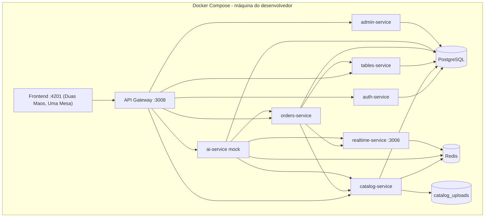
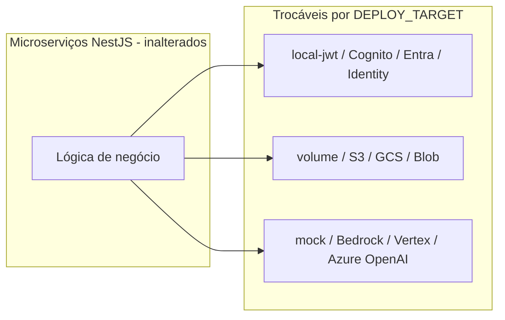

# Arquitetura

**Padrão:** execução **local** com Docker Compose (sem nuvem obrigatória).

**Futuro:** mesma arquitetura de microserviços em AWS, Google Cloud ou Azure — ver [docs/cloud-providers.md](docs/cloud-providers.md).

## Local (runtime atual)



## Portabilidade (camada de adaptadores)



| Documento | Conteúdo |
|-----------|----------|
| [docs/arquitetura-local.md](docs/arquitetura-local.md) | Diagrama, portas, bancos, comandos |
| [docs/cloud-providers.md](docs/cloud-providers.md) | Mapeamento AWS / GCP / Azure |
| [docs/env-contract.md](docs/env-contract.md) | Variáveis `AUTH_PROVIDER`, `STORAGE_BACKEND`, `LLM_PROVIDER` |

## Subir localmente

```powershell
copy .env.example .env
docker compose up -d --build
```
