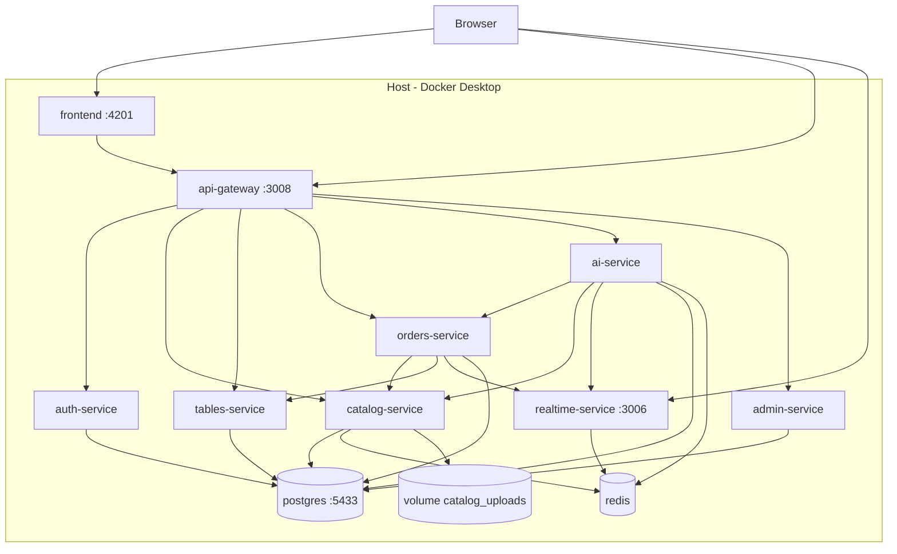

# Arquitetura local (padrão do projeto)

O case roda **100% na sua máquina** via Docker Compose. Nenhuma conta em nuvem é obrigatória.

## Princípio

| Camada | Local (hoje) | Nuvem (futuro) |
|--------|--------------|----------------|
| Orquestração | Docker Compose | ECS / Cloud Run / Container Apps |
| Banco | PostgreSQL (container) | RDS / Cloud SQL / Azure PostgreSQL |
| Cache | Redis (container) | ElastiCache / Memorystore / Azure Cache |
| Fotos | Volume `catalog_uploads` | S3 / GCS / Blob Storage |
| Auth equipe | JWT + seed (`auth-service`) | Cognito / Identity Platform / Entra ID |
| IA | `LLM_PROVIDER=mock` | Bedrock / Vertex AI / Azure OpenAI |
| Frontend | nginx (:4201) | CDN + bucket estático |
| Realtime | Socket.IO (:3006) | Mesmo serviço + Redis adapter |

A **lógica de negócio** (pedidos, cozinha, cardápio, chat com tools) não muda entre local e nuvem — só trocam **drivers** (armazenamento, auth, LLM).

## Diagrama



## Portas no host

| Serviço | Porta host | Observação |
|---------|------------|------------|
| frontend | 4201 | Angular via nginx |
| api-gateway | 3008 | API REST `/api` |
| realtime-service | 3006 | WebSocket |
| postgres | 5433 | Evita conflito com Postgres local |
| redis | — | Apenas rede Docker |

## Bancos PostgreSQL

Um container Postgres, **6 databases** (init em `infra/postgres/init-databases.sql`):

- `restaurante_auth`
- `restaurante_catalog`
- `restaurante_tables`
- `restaurante_orders`
- `restaurante_ai`
- `restaurante_admin`

## Subir / parar

```powershell
cd c:\dev\virtual-chat-assistant
copy .env.example .env
docker compose up -d --build
docker compose ps
docker compose logs -f api-gateway
docker compose down
```

## Variáveis que definem o modo local

Ver `.env.example`. Resumo:

```env
DEPLOY_TARGET=local
STORAGE_BACKEND=local
AUTH_PROVIDER=local-jwt
LLM_PROVIDER=mock
```

## O que não precisa de nuvem para demonstrar o case

- Fluxo cliente (mesa → cardápio → chat → pedido)
- Cozinha, garçom, caixa (JWT + WebSocket)
- Admin (produtos, foto, empresa, config IA)
- Microserviços isolados com DB dedicado
- Tools da IA executando pedidos reais (modo mock)

## Preparação para nuvem (sem implementar agora)

Contratos de ambiente e mapeamento por provedor: [cloud-providers.md](./cloud-providers.md).

Variáveis detalhadas: [env-contract.md](./env-contract.md).
